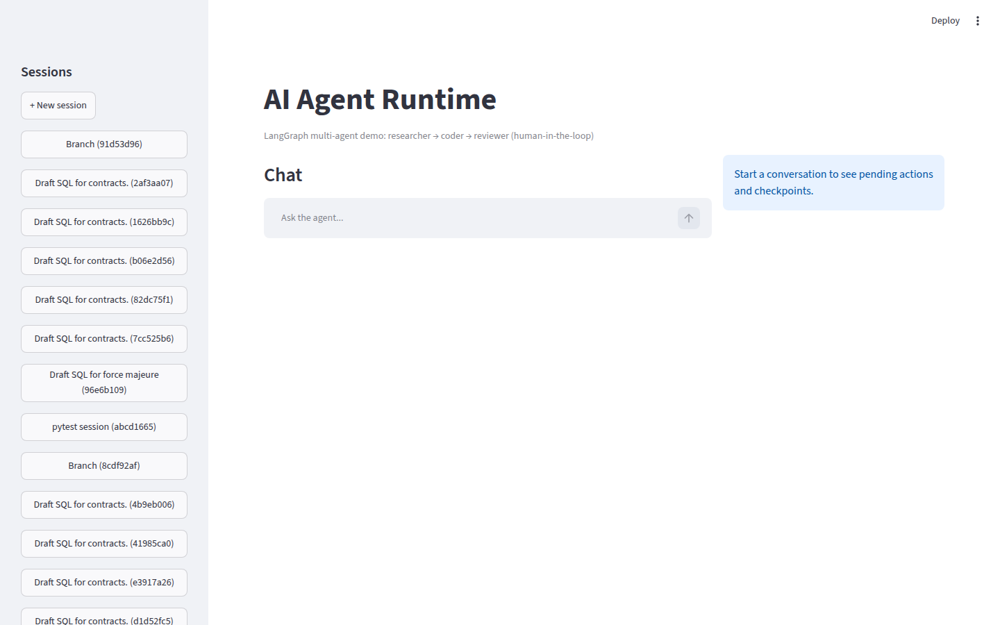
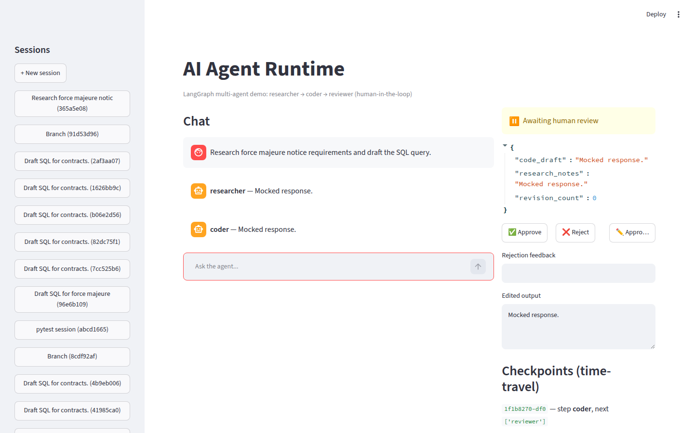
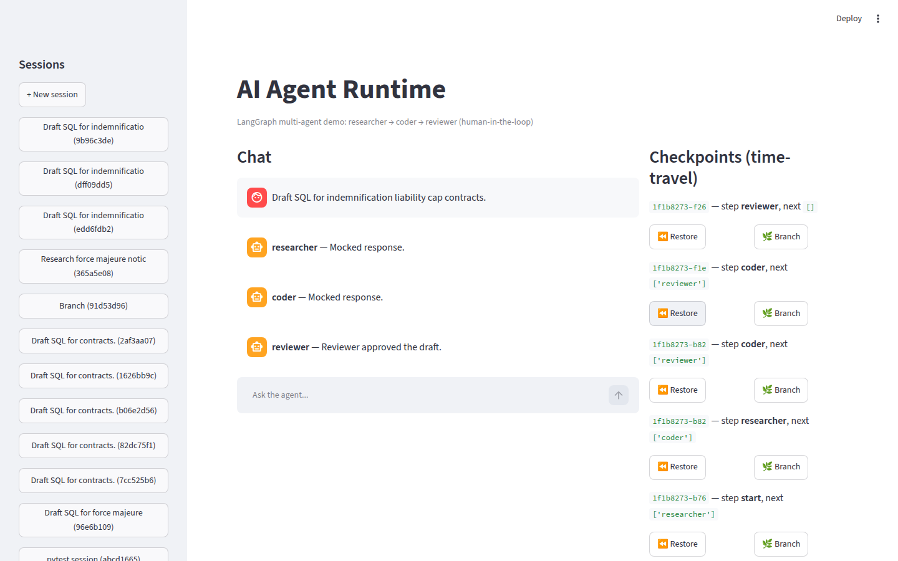
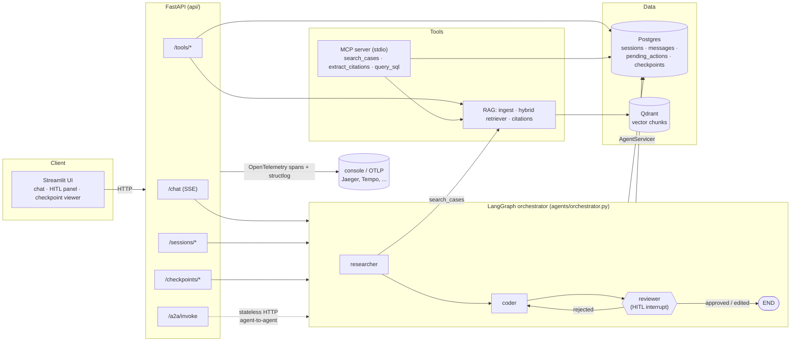

# AI Agent Runtime

A production-shaped multi-agent AI platform built with **LangGraph**: stateful orchestration,
Postgres-backed checkpoints with time-travel, human-in-the-loop review, MCP tools, agent-to-agent
(A2A) communication, and a RAG pipeline with citations -- all runnable locally with **zero external
API keys**.

> Portfolio project. Every feature below is real and tested, not a stub: the checkpoints are
> actually written to Postgres, the HITL pause actually interrupts the graph, the MCP server is a
> real stdio subprocess, and the whole suite runs offline against a scripted fake LLM.

## Screenshots

| Chat + sessions | HITL review panel | Checkpoint time-travel |
|---|---|---|
|  |  |  |

## Architecture



**Key design choices** (see [`docs/ARCHITECTURE.md`](docs/ARCHITECTURE.md) for the full rationale):

- **Checkpointing**: LangGraph's own `AsyncPostgresSaver` is the source of truth for graph
  state/time-travel -- no parallel checkpoint table to keep in sync.
- **HITL**: the graph is compiled with `interrupt_before=["reviewer"]`; a human decision
  (`approved` / `rejected` / `edited`) is written into state and the graph is resumed.
- **RAG**: Qdrant (vector) + BM25 (`rank_bm25`) fused via reciprocal rank fusion, with a
  pluggable embeddings provider (`fake` by default -- deterministic, zero network -- or
  `ollama`/`openai`).
- **MCP**: a real `mcp` SDK stdio server (`agents/tools/mcp_server.py`) wrapping the same
  `search_cases` / `extract_citations` / `query_sql` functions the HTTP `/tools` routes use.
- **A2A**: `/a2a/invoke` exposes researcher/coder/reviewer as independent, stateless HTTP
  services, addressed by name through an `A2A_REGISTRY` env-configured registry.

## Quickstart

Requirements: Docker + Docker Compose, Python 3.11+. Everything below works with **no** LLM
API key (`LLM_PROVIDER=fake`/`ollama` by default) and **no** internet access after the initial
`pip install`.

```bash
git clone <this-repo> && cd ai-agent-runtime
cp .env.example .env

python3 -m venv .venv && source .venv/bin/activate
pip install -r requirements.txt        # or: uv pip install -r requirements.txt (much faster)

docker compose -f infra/docker-compose.yml up -d postgres qdrant redis
alembic upgrade head
python -m db.seed
python -m rag.ingest data/sample_docs

uvicorn api.app:app --reload           # terminal 1
streamlit run ui/app.py                # terminal 2
```

Or, once `.env` exists: `./scripts/run_local.sh` does all of the above except starting the UI.

Open http://localhost:8501 for the UI, or http://localhost:8000/docs for the interactive API docs.

### One-shot via Docker Compose

```bash
docker compose -f infra/docker-compose.yml up -d --build
```

Brings up Postgres, Qdrant, Redis, the API (`:8000`) and the UI (`:8501`). Run migrations/seed/ingest
against it the same way (`alembic upgrade head`, etc.) or exec into the `api` container.

### Verify everything works

```bash
python scripts/validate_local.py
```

```
✅ Postgres: reachable at localhost:5432/agent_runtime
✅ Qdrant: reachable at http://localhost:6333
✅ Agent run (fake LLM, HITL pause/resume): researcher -> coder -> reviewer (HITL pause/resume) all worked

✅ All components working locally.
```

## Example requests

```bash
# Start a chat turn (SSE stream of node-progress events, ending in a pending-review pause)
curl -N -X POST http://localhost:8000/chat \
  -H 'Content-Type: application/json' \
  -d '{"message": "Research force majeure notice requirements and draft the SQL query."}'

# Inspect what's awaiting human review
curl http://localhost:8000/sessions/<session_id>/pending_actions

# Approve it (resumes the graph to completion)
curl -X POST http://localhost:8000/sessions/<session_id>/resume \
  -H 'Content-Type: application/json' \
  -d '{"review_status": "approved"}'

# Full checkpoint history (time-travel)
curl http://localhost:8000/checkpoints/<session_id>

# Rewind to an earlier checkpoint
curl -X POST http://localhost:8000/checkpoints/<session_id>/restore \
  -H 'Content-Type: application/json' \
  -d '{"checkpoint_id": "<checkpoint_id>"}'

# RAG search directly
curl -X POST http://localhost:8000/tools/search_cases \
  -H 'Content-Type: application/json' \
  -d '{"query": "force majeure notice period", "top_k": 3}'
```

## Local development

### Requirements
- Docker + Docker Compose
- Python 3.11+
- (Optional) [Ollama](https://ollama.com) for a real local LLM (`LLM_PROVIDER=ollama` in `.env`)

### Environment / provider switches (`.env`, see `.env.example`)

| Var | Values | Notes |
|---|---|---|
| `LLM_PROVIDER` | `ollama` (default) / `openai` / `gemini` / `fake` | `fake` needs no network -- used by the whole test suite |
| `EMBEDDINGS_PROVIDER` | `fake` (default) / `ollama` / `openai` | `fake` is a deterministic hash embedding |

### Tests

```bash
pytest tests/ -v --cov=agents --cov=api --cov=rag --cov-report=term-missing
```

36 tests across orchestrator/HITL, the FastAPI layer, RAG (ingest/retrieve/citations/evals), MCP
(real stdio subprocess round trips), and A2A (real HTTP round trips over ASGI transport) -- all
against the offline `fake` LLM, so no network calls or API keys are needed. Integration tests use
the real Postgres/Qdrant containers from `infra/docker-compose.yml`. Coverage across
`agents`/`api`/`rag` is ~85% (`--cov-report=term-missing` shows exactly what's not exercised).

```bash
ruff check .          # lint
mypy agents api rag db  # type check
python -m rag.evals.evaluate   # RAG retrieval-hit-rate + keyword-faithfulness report
```

## Project structure

```
agents/            LangGraph orchestrator, subagents, tools (MCP/A2A/SQL/legal), memory, config
  subagents/        researcher, coder, reviewer (HITL)
  tools/            mcp_server.py, mcp_client.py, a2a_client.py, sql_tool.py, legal_tools.py
  memory/           Postgres + in-memory checkpointer factories
api/                FastAPI app: routes (chat/sessions/checkpoints/tools/a2a), middleware
rag/                ingest, hybrid retriever, citations, embeddings, evals/
db/                 SQLAlchemy models, Alembic migrations, seed script
infra/              Dockerfile, docker-compose.yml
ui/                 Streamlit app + components (chat, checkpoint viewer, pending actions)
data/sample_docs/   fake legal corpus (markdown + generated PDFs) used by RAG
notebooks/          MCP protocol walkthrough
scripts/            run_local.sh, validate_local.py
tests/              orchestrator, API, RAG, MCP, A2A tests
```

## What's intentionally scoped down

This is a local-first portfolio build, not a hardened multi-tenant SaaS. In particular: no
Kubernetes manifests (Docker Compose only), CD pushes to GHCR rather than deploying anywhere, and
the in-process `/metrics` endpoint is a lightweight stand-in for a real Prometheus/OTel-metrics
pipeline. See [`docs/ARCHITECTURE.md`](docs/ARCHITECTURE.md) for the reasoning behind each of
these choices and what a hardened version would add.
